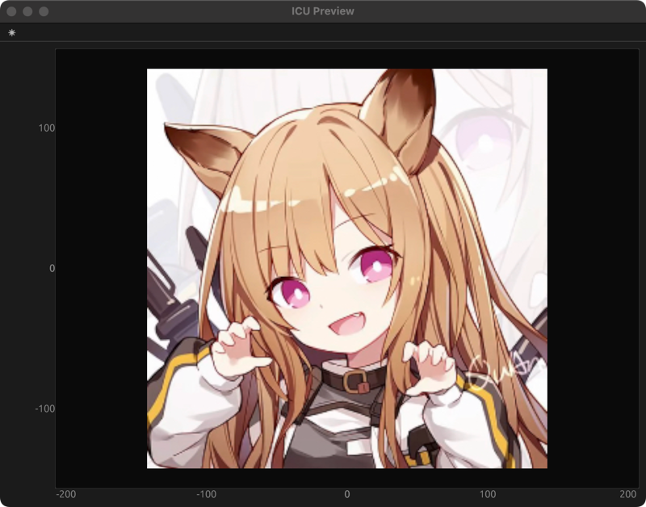

# ICU

Image Converter Ultra

# Introduction

The Image Converter Ultra (ICU) is a software that converts images from one format to another. It is designed to be a
versatile tool that can handle a wide range of image formats and convert them to other formats. The ICU is designed to
be a standalone application that can be used on any platform that supports the necessary dependencies. The ICU is
written in RUST.

# Features

- Supports a wide range of image formats
- Supports LVGL binary format
- Supports preview a wide range of image formats and LVGL binary format

# How to install

ICU is a standalone application that can be installed on any platform that supports the necessary dependencies.

- **Homebrew**

```shell
brew install W-Mai/homebrew-cellar/icu_tool
```

or

```shell
brew tap W-Mai/homebrew-cellar
brew install icu_tool
```

- **PowerShell**

```powershell
powershell -c "irm https://github.com/W-Mai/icu/releases/download/v0.1.14/icu_tool-installer.ps1 | iex"
```

- **Shell**

```shell
curl --proto '=https' --tlsv1.2 -LsSf https://github.com/W-Mai/icu/releases/download/v0.1.14/icu_tool-installer.sh | sh
```

- **Windows MSI Installer**

Download the latest `Windows MSI Installer` from the [releases page](https://github.com/W-Mai/icu/releases/latest) and
install it.

- **Cargo**

ICU is written in RUST, so you need to have the RUST environment installed on your system.

```shell
curl --proto '=https' --tlsv1.2 -sSf https://sh.rustup.rs | sh
```

After that, you can install ICU by running the following command:

```shell
cargo install icu_tool
```

# How to use auto-completion feature

ICU supports auto-completion feature for shells like `bash`, `zsh`, `fish` and `powershell`.

- **Bash**

Add the following line to your `.bashrc` or `.bash_profile` file:

```shell
eval "$(icu -I bash)"
```

- **Zsh**

Add the following line to your `.zshrc` file:

```shell
eval "$(icu -I zsh)"
```

- **Fish**

Add the following line to your `config.fish` file:

```shell
icu -I fish | source
```

# How to build yourself

```shell
git clone https://github.com/W-Mai/icu.git
cd icu
cargo build --release
```

# How to use

```shell
$ icu -h

`Show` or `Convert` image files to any other image format including LVGL image formats.

Usage: icu [OPTIONS] <COMMAND>

Commands:
  info     Show some information about an image file
  show     Show an image file
  convert  Convert image files to any other image format including LVGL image formats
  help     Print this message or the help of the given subcommand(s)

Options:
  -v, --verbose...  verbose mode
  -h, --help        Print help
  -V, --version     Print version

```

```shell
$ icu info -h

Show some information about an image file

Usage: icu info [OPTIONS] <FILE>

Arguments:
  <FILE>  an image file to show

Options:
  -f, --input-format <INPUT_FORMAT>  input image formats [default: auto] [possible values: auto, common, lvgl-v9]
  -h, --help                         Print help (see more with '--help')

```

```shell
icu convert -h

Convert image files to any other image format including LVGL image formats

Usage: icu convert [OPTIONS] --output-format <OUTPUT_FORMAT> <INPUT_FILES>...

Arguments:
  <INPUT_FILES>...  input files

Options:
  -f, --input-format <INPUT_FORMAT>
          input image formats [default: auto] [possible values: auto, common, lvgl-v9]
  -O, --output-folder <OUTPUT_FOLDER>
          output folder
  -r, --override-output
          override exist output files, and you will get a warning message for sure if the output file already exists
  -G, --output-category <OUTPUT_CATEGORY>
          output image format categories [default: common] [possible values: common, bin, c-array]
  -F, --output-format <OUTPUT_FORMAT>
          output image formats [possible values: png, jpeg, bmp, gif, tiff, webp, ico, pbm, pgm, ppm, pam, lvgl]
  -S, --output-stride-align <OUTPUT_STRIDE_ALIGN>
          stride of the output image [default: 1]
  -C, --output-color-format <OUTPUT_COLOR_FORMAT>
          output color formats [possible values: rgb565, rgb565a8, rgb888, argb8888, xrgb8888, a1, a2, a4, a8, l8, i1, i2, i4, i8]
      --dither <DITHER>
          dither the output image so that it will look better on screens with low color depth 1 to 30, 1 is the best quality and 30 is the worst quality. 10 is recommended
      --lvgl-version <LVGL_VERSION>
          LVGL Version, needed if [`ImageFormats`] is [`ImageFormats::LVGL`] [default: v9] [possible values: v9, v8]
  -h, --help
          Print help (see more with '--help')
```

```shell
$ icu show -h

Show an image file

Usage: icu show [OPTIONS] <FILE>

Arguments:
  <FILE>  an image file to show

Options:
  -f, --input-format <INPUT_FORMAT>  input image formats [default: auto] [possible values: auto, common, lvgl-v9]
  -h, --help                         Print help (see more with '--help')
```

# Example

## Show an common image format

```shell
icu show res/img_0.png
```

You will get a window with the image.



## Show an LVGL image format

* You don't need to specify the input format, because ICU can detect it automatically. *

```shell
icu show res/img_0.bin
```

And you will get a window with the image like before.

## Convert an common image format to an common image format

if you want to converting images with logs out put, you can use `-vv` option.

```shell
$ icu -vv convert res/img_0.png res/img_0.jpeg --output-format webp`

[2024-02-29T13:05:06Z INFO  icu] Start converting files
[2024-02-29T13:05:06Z INFO  icu] 
[2024-02-29T13:05:06Z INFO  icu] took 0.002740s for converting [res/img_0.png] to [res/img_0.webp] with format [WEBP] 
[2024-02-29T13:05:06Z INFO  icu] took 0.002257s for converting [res/img_0.jpeg] to [res/img_0.webp] with format [WEBP] 
[2024-02-29T13:05:06Z INFO  icu] 
[2024-02-29T13:05:06Z INFO  icu] Total converting time:
[2024-02-29T13:05:06Z INFO  icu]        Consuming  : 0.005121s for 2 files
[2024-02-29T13:05:06Z INFO  icu]        User   time: 0.004998s
[2024-02-29T13:05:06Z INFO  icu]        System time: 0.000123s
```

or in a short form:

```shell
$ icu -vv convert res/img_0.png res/img_0.jpeg -F webp
```

## Convert some images in a folder to another specific folder

convert all images in the `res` folder to jpeg format and save them in the `res/output` folder, if the output file
already exists, it will override it (you should use `-r --override-output` option).

*if and the output folder will keep the same structure as the input folder*.

```shell
$ icu convert res -O res/output --output-format jpeg --override-output
```

or in a short form:

```shell
$ icu convert res -O res/output -F jpeg -r
```

## Convert an LVGL image format to an common image format

Convert an LVGL image format to an common image format.
And if you specify the `--overide-output` option, ICU will override the output file if it already exists.
And you will get a warning message for sure if the output file already exists.

```shell
$ icu -vv convert res/img_0.bin -O res/output -F jpeg -r

[2024-03-03T16:08:01Z INFO  icu] Start converting file
[2024-03-03T16:08:01Z INFO  icu] 
[2024-03-03T16:08:01Z WARN  icu] Override output file <res/output/img_0.jpeg> for converting <res/img_0.bin>
[2024-03-03T16:08:01Z INFO  icu] took 0.007022s for converting <res/img_0.bin> to <res/output/img_0.jpeg> with format <JPEG>
[2024-03-03T16:08:01Z INFO  icu] 
[2024-03-03T16:08:01Z INFO  icu] Total converting time:
[2024-03-03T16:08:01Z INFO  icu]        Consuming  : 0.008715s for 1 files
[2024-03-03T16:08:01Z INFO  icu]        User   time: 0.007022s
[2024-03-03T16:08:01Z INFO  icu]        System time: 0.001693s

```

## Convert an common image format to an LVGL image format

Convert an common image format to an LVGL image format, you need to specify the output color format and lvgl version.
But if you don't specify the lvgl version, ICU will use the default version (v9).

```shell
$ icu convert res/img_0.png -O res/output -F lvgl -C i8 -r
```

## Convert an common image format to an LVGL image format with stride align

Convert an common image format to an LVGL image format with stride align, you need to specify the output color format,
lvgl version, and stride align (default is 1).

***4** means the stride of the output image will be 4 bytes aligned.*

```shell
$ icu convert res/img_0.png -O res/output -F lvgl -C i8 -S 4 -r
```

## License

ICU is licensed under the MIT license.
