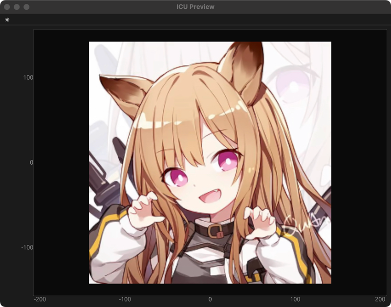

# ICU

Image Converter Ultra

# Introduction

The Image Converter Ultra (ICU) is a software that converts images from one format to another. It is designed to be a
versatile tool that can handle a wide range of image formats and convert them to other formats. The ICU is designed to
be a standalone application that can be used on any platform that supports the necessary dependencies. The ICU is
written in RUST.

# Features

- Supports a wide range of image formats
- Supports LVGL binary format
- Supports preview a wide range of image formats and LVGL binary format

# How to install

ICU is written in RUST, so you need to have the RUST environment installed on your system.

```shell
curl --proto '=https' --tlsv1.2 -sSf https://sh.rustup.rs | sh
```

After that, you can install ICU by running the following command:

```shell
cargo install icu_tool
```

# How to build yourself

```shell
cargo build --release
```

# How to use

```shell
$ icu -h

`Show` or `Convert` image files to any other image format including LVGL image formats.

Usage: icu [OPTIONS] <COMMAND>

Commands:
  show     Show an image file
  convert  Convert image files to any other image format including LVGL image formats
  help     Print this message or the help of the given subcommand(s)

Options:
  -v, --verbose...  verbose mode
  -h, --help        Print help
  -V, --version     Print version

```

```shell
$ icu convert -h

Convert image files to any other image format including LVGL image formats

Usage: icu convert [OPTIONS] --input-files <INPUT_FILES> --output-category <OUTPUT_CATEGORY> --output-format <OUTPUT_FORMAT> --output-color-format <OUTPUT_COLOR_FORMAT>

Options:
  -i, --input-files <INPUT_FILES>
          input files
  -f, --input-format <INPUT_FORMAT>
          input image formats [default: common] [possible values: common, lvgl-v9]
  -g, --output-category <OUTPUT_CATEGORY>
          output image format categories [possible values: common, bin, c-array]
  -F, --output-format <OUTPUT_FORMAT>
          output image formats [possible values: png, jpeg, bmp, gif, tiff, webp, ico, pbm, pgm, ppm, pam, lvgl]
  -S, --output-stride-align <OUTPUT_STRIDE_ALIGN>
          stride of the output image [default: 1]
  -C, --output-color-format <OUTPUT_COLOR_FORMAT>
          output color formats [possible values: rgb565, rgb565a8, rgb888, argb8888, xrgb8888, a1, a2, a4, a8, l8, i1, i2, i4, i8]
      --dither
          dither the output image so that it will look better on screens with low color depth
      --lvgl-version <LVGL_VERSION>
          LVGL Version, needed if [`ImageFormats`] is [`ImageFormats::LVGL`] [default: v9] [possible values: v9, v8]
  -h, --help
          Print help (see more with '--help')
```

```shell
$ icu show -h

Show an image file

Usage: icu show [OPTIONS] <FILE>

Arguments:
  <FILE>  an image file to show

Options:
  -f, --input-format <INPUT_FORMAT>  input image formats [default: common] [possible values: common, lvgl-v9]
  -h, --help                         Print help (see more with '--help')
```

# Example

## Show an common image format

```shell
icu show res/img_0.png
```

You will get a window with the image.



## Show an LVGL image format

```shell
icu show res/img_0.bin -f lvgl-v9
```

And you will get a window with the image like before.

